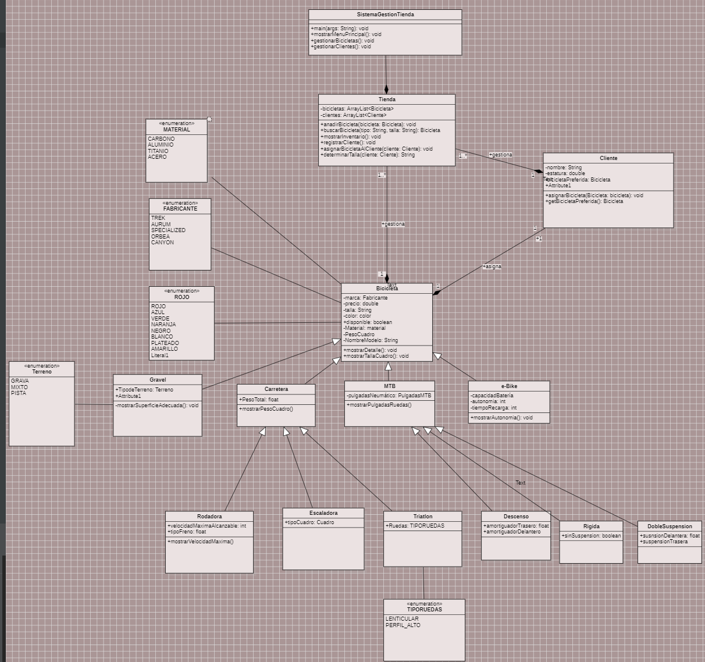

# TFC - Proyecto de Fin de Ciclo

En este repositorio se encuentra todo el proceso del proyecto de fin de ciclo. La idea inicial es crear un comercio electrónico de bicicletas.

## Descripción del Proyecto

El proyecto consiste en desarrollar una plataforma de comercio electrónico especializada en la venta de bicicletas. En esta plataforma, se implementará un sistema completo de control y seguimiento del stock de los artículos, siguiendo el diagrama de clases planteado.

### Funcionalidades Principales

- **Añadir artículos**: Permite agregar nuevos productos al inventario.
- **Eliminar artículos**: Posibilidad de eliminar productos que ya no estén disponibles o sean obsoletos.
- **Modificar artículos**: Facilita la actualización de información de los productos existentes, como precios, descripciones y cantidades.
- **Mostrar artículos**: Visualización de todos los productos disponibles en el inventario con sus respectivas características.

### Generación de Facturas

La aplicación podrá generar facturas simuladas a los usuarios en función de los artículos que adquiera.

## Diagrama de Clases

La aplicación se se basará fundamentalmente en el siguiente diagrama de clases(La aplicacion puede estar sujeta a algunos cambios)

Este proyecto es parte del trabajo de fin de ciclo, buscando integrar los conocimientos adquiridos y aplicarlos en un entorno de desarrollo real..

Fundamentalmente aunará temario de Programación, Bases de Datos y Entornos de desarrollo
